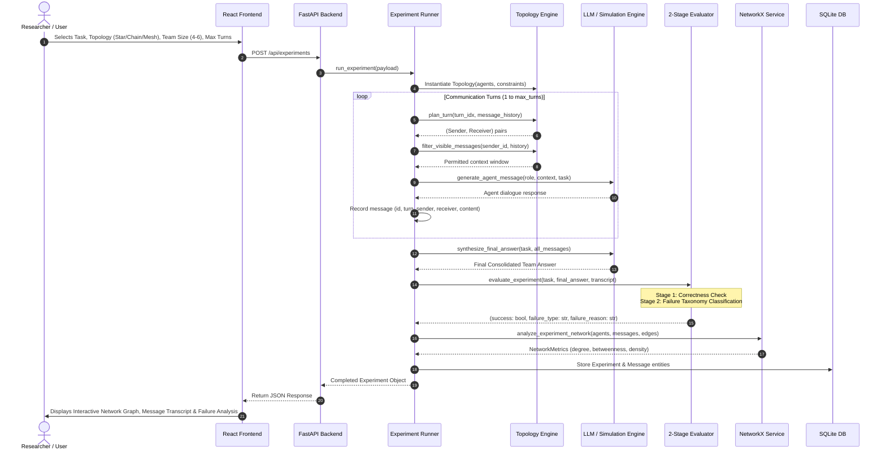
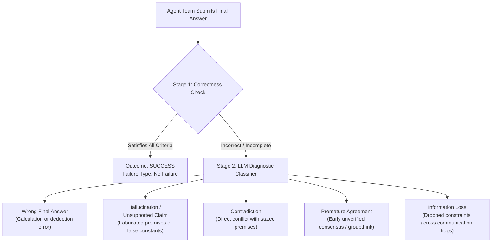
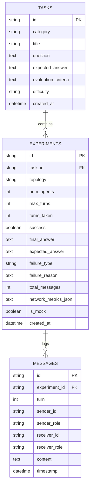

# MAST Topology Lab: Complete Architecture & Workflow Guide 🔬

> **Multi-Agent System Topology Research Platform for LLMs**  
> Comprehensive technical documentation explaining the end-to-end multi-agent execution pipeline, topological routing engines, failure classification taxonomy, graph theory metrics, and statistical hypothesis testing.

---

## Table of Contents
1. [System Overview & Research Question](#1-system-overview--research-question)
2. [End-to-End Experiment Execution Workflow](#2-end-to-end-experiment-execution-workflow)
3. [Topology Engine & Routing Mechanics](#3-topology-engine--routing-mechanics)
4. [Agent Team Roles & Prompt Design](#4-agent-team-roles--prompt-design)
5. [Two-Stage Failure Classification Taxonomy](#5-two-stage-failure-classification-taxonomy)
6. [Network Analysis & Mathematical Metrics (NetworkX)](#6-network-analysis--mathematical-metrics-networkx)
7. [Statistical Significance & Chi-Square Analysis (SciPy)](#7-statistical-significance--chi-square-analysis-scipy)
8. [Database Schema & State Persistence](#8-database-schema--state-persistence)
9. [Frontend User Experience & Interactive Visualizers](#9-frontend-user-experience--interactive-visualizers)
10. [Step-by-Step Demonstration Walkthrough](#10-step-by-step-demonstration-walkthrough)

---

## 1. System Overview & Research Question

### The Core Problem
When large language models (LLMs) collaborate in teams, prompting and persona design are well studied, but **the communication topology—the graph structure dictating who can talk to whom—fundamentally impacts:**
1. **Reasoning Quality & Accuracy**: Does a central hub produce better solutions than a sequential pipeline or a dense mesh?
2. **Communication Cost**: What is the token/message trade-off between centralized and decentralized topologies?
3. **Specific Failure Vulnerabilities**: Does a Chain topology suffer more from *Information Loss*, while a Star topology suffers from *Premature Agreement*?

### The Solution: MAST Topology Lab
MAST Topology Lab is a full-stack experimental platform where researchers can choose benchmark tasks, configure 4–6 agent teams under rigid communication topologies (**Star**, **Chain**, **Mesh**), log every message exchange, compute NetworkX centrality metrics, classify failure modes, and run Chi-Square tests of independence.

---

## 2. End-to-End Experiment Execution Workflow

The diagram below illustrates the exact sequence from user configuration in the web dashboard to final statistical aggregation:



---

## 3. Topology Engine & Routing Mechanics

The topology engine algorithmically enforces communication boundaries rather than relying on LLM self-restraint.

```
       STAR TOPOLOGY                  CHAIN TOPOLOGY                  MESH TOPOLOGY
       -------------                  --------------                  -------------
           (A1) Coordinator                (A1) Coordinator               (A1) <====> (A2)
          /  |  \                            |                             \\  \    /  //
        v   v    v                           v                              \\  \  /  //
      (A2) (A3) (A4)                       (A2) Solver                     (A5) <==> (A3)
     Solver Critic FactChecker               |                                \      /
                                             v                                 \    /
      [Hub-and-Spoke]                      (A3) Critic                          (A4)
      - A1 <-> Ai permitted                  |
      - Ai <-> Aj FORBIDDEN                  v                            [Fully Connected]
                                           (A4) FactChecker               - All-to-all pairs
                                             |                            - Complete Graph
                                             +----------> (A1)
```

### 1. STAR Topology (`StarTopology`)
- **Central Coordinator Hub ($A_1$)**: Agent 1 (Coordinator) can send to and receive from all peripheral agents $A_2, A_3, \dots, A_N$.
- **Peripheral Agents ($A_2..A_N$)**: Can only send messages to the Central Coordinator ($A_1$). Direct lateral communication between peripheral agents is **strictly prohibited**.
- **Turn Schedule**: Even turns ($0, 2, 4\dots$) transmit from Coordinator to a peripheral specialist; Odd turns ($1, 3, 5\dots$) transmit specialists' audits back to Coordinator.

### 2. CHAIN Topology (`ChainTopology`)
- **Sequential Pipeline**: Each agent can only receive context from their immediate predecessor and pass refined deductions to their immediate successor:
  $$\text{Allowed Links: } A_1 \to A_2 \to A_3 \to \dots \to A_N \to A_1$$
- **Turn Schedule**: Turn $k$ executes $A_{k \bmod N} \to A_{(k+1) \bmod N}$.
- **Vulnerability**: Information can degrade or drop across multiple sequential hops (*Information Loss*).

### 3. MESH Topology (`MeshTopology`)
- **Complete Graph ($K_N$)**: Every agent is permitted to communicate directly with any other agent.
- **Turn Schedule**: Alternating peer-to-peer dialogues across rounds, exploring diverse perspectives.
- **Vulnerability**: Highest message volume and potential for conflicting arguments (*Contradiction*).

---

## 4. Agent Team Roles & Prompt Design

The system provides 6 specialized roles arranged in a fixed hierarchy:

| Role | Default ID | Primary Responsibility |
| :--- | :--- | :--- |
| **Coordinator** | `agent_1` | Decomposes tasks, delegates subproblems, resolves contradictions, synthesizes final team consensus. |
| **Solver** | `agent_2` | Primary analytical solver; formulates step-by-step logic, equations, and solutions. |
| **Critic** | `agent_3` | Adversarial auditor; hunts for hidden assumptions, fallacies, edge cases, and invalid deductions. |
| **Fact Checker** | `agent_4` | Verifies constraint adherence, empirical constants, units, and stated boundary conditions. |
| **Alternative Solver** | `agent_5` | *(Included in 5–6 agent teams)* Explores distinct counter-hypotheses to prevent groupthink. |
| **Final Reviewer** | `agent_6` | *(Included in 6 agent teams)* Quality gate auditor checking completeness before output synthesis. |

---

## 5. Two-Stage Failure Classification Taxonomy

When an experiment completes, it undergoes a two-stage academic evaluation:



### The 5 Target Failure Categories:
1. **Wrong Final Answer**: The team followed valid steps but committed an arithmetic, mathematical, or deduction error.
2. **Hallucination / Unsupported Claim**: The team introduced ungrounded facts, false physics constants, or nonexistent constraints.
3. **Contradiction**: The final answer directly contradicts an earlier verified step or explicit prompt premise.
4. **Premature Agreement**: The coordinator or team prematurely locked onto an early flawed hypothesis without adequate critical audit (common in Star).
5. **Information Loss**: Critical premises, boundary constraints, or partial deductions were omitted or corrupted across sequential hops (common in Chain).

---

## 6. Network Analysis & Mathematical Metrics (NetworkX)

Using Python's `NetworkX` library, each experimental run produces a directed weighted graph $G = (V, E, W)$, where vertices $V$ are agents and directed edges $(u, v) \in E$ represent message transmissions with weight $w(u, v)$ equal to message frequency.

### Mathematical Formulations:

1. **Total Degree & In/Out-Degree**:
   $$\deg_{\text{in}}(v) = |\{u \in V : (u, v) \in E\}|, \quad \deg_{\text{out}}(v) = |\{u \in V : (v, u) \in E\}|$$
   $$\deg(v) = \deg_{\text{in}}(v) + \deg_{\text{out}}(v)$$

2. **Betweenness Centrality**:
   Measures how often an agent lies on the shortest communication path between all other agent pairs:
   $$C_B(v) = \sum_{s \neq v \neq t} \frac{\sigma_{st}(v)}{\sigma_{st}}$$
   *In Star topology, Coordinator betweenness $C_B(A_1) \approx 1.0$, while peripheral agents $C_B(A_i) = 0.0$.*

3. **Communication Network Density ($\rho$)**:
   The ratio of active directed edges to the maximum possible edges:
   $$\rho = \frac{|E|}{|V|(|V| - 1)}$$
   *For a 5-agent team: $\rho_{\text{Star}} = \frac{8}{20} = 0.40$, $\rho_{\text{Chain}} = \frac{5}{20} = 0.25$, $\rho_{\text{Mesh}} = \frac{20}{20} = 1.0$.*

---

## 7. Statistical Significance & Chi-Square Analysis (SciPy)

To test whether communication topology significantly influences the distribution of multi-agent failure modes, the system computes Pearson's Chi-Square Test of Independence ($\chi^2$):

### The Hypotheses:
- **Null Hypothesis ($H_0$)**: Communication topology and failure mode occurrence are independent.
- **Alternative Hypothesis ($H_1$)**: Communication topology significantly affects failure mode distribution ($p < 0.05$).

### The Test Statistic:
$$\chi^2 = \sum_{i=1}^{r} \sum_{j=1}^{c} \frac{(O_{ij} - E_{ij})^2}{E_{ij}}$$
Where:
- $O_{ij}$ = Observed count of failure type $j$ in topology $i$.
- $E_{ij} = \frac{R_i \times C_j}{N}$ = Expected frequency under $H_0$.
- Degrees of Freedom: $df = (r - 1)(c - 1) = (3 - 1)(6 - 1) = 10$.

*If $N < 5$, the platform gracefully reports that additional trials are required rather than crashing.*

---

## 8. Database Schema & State Persistence

The SQLite database (`mast_lab.db`) is automatically initialized with 3 relational tables:



---

## 9. Frontend User Experience & Interactive Visualizers

- **Theme Engine**: Complete synchronization between **Light Mode** and **Dark Mode** via CSS custom variables (`var(--bg-card)`, `var(--border-color)`).
- **Topology Graph Visualizer**: Dynamic SVG rendering showing directional arrows, message weights, animated transmission halos, and hover cards displaying Betweenness Centrality.
- **Live Execution Monitor**: Real-time dialogue feed streaming agent outputs during deliberation.
- **Comparison Matrix**: Side-by-side performance cards with integrated Chi-Square test statistics and contingency tables.

---

## 10. Step-by-Step Demonstration Walkthrough

1. **Launch**:
   - Backend: `python -m uvicorn app.main:app --host 127.0.0.1 --port 8000 --reload`
   - Frontend: `npm run dev` in `frontend/`
   - Open `http://localhost:5173`.
2. **Execute a Trial**:
   - Navigate to **Run Experiment**.
   - Choose `Reasoning` -> `Knights and Knaves Island Logic`.
   - Select **STAR** topology, 4 agents, 6 turns.
   - Click **Run Single Experiment**.
3. **Inspect the Results**:
   - View the **Network Graph** (hover over $A_1$ Coordinator to inspect $C_B$).
   - Check the **Final Answer vs Expected Answer** and the Stage 2 failure diagnosis.
   - Read through the chronological message transcript.
4. **Run a Multi-Topology Sweep**:
   - Click **Run 3-Topology Sweep** (executes 9 trials: 3 Star + 3 Chain + 3 Mesh).
5. **View Comparative & Statistical Analysis**:
   - Open **Compare Topologies** to analyze the comparative matrix and the **Chi-Square ($\chi^2$) statistic & $p$-value**.
