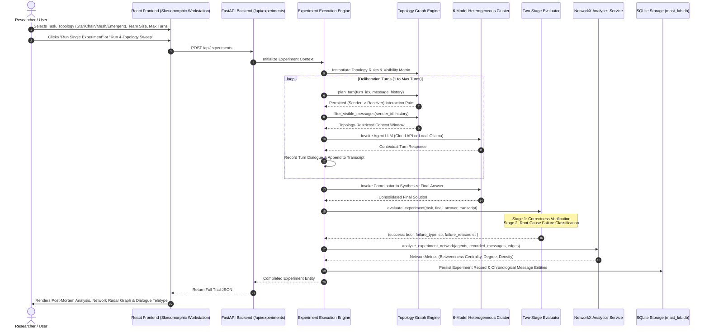

# MAST Topology Lab - Complete Project, Workflow & Operational Guide

> **MAST (Multi-Agent System Topology) Lab**  
> Empirical Research & Benchmarking Platform for Heterogeneous Multi-Agent LLM Communication Networks

---

## 1. Executive Summary & Project Purpose

### What is this Project?
**MAST Topology Lab** is an experimental AI research workstation designed to investigate how **communication network topologies** dictate the reasoning performance, error propagation, token overhead, and failure modes of **collaborative Multi-Agent Large Language Model (LLM) clusters**.

While standard multi-agent research focuses on single-model personas or prompt templates, MAST Topology Lab introduces two critical empirical dimensions:
1. **Heterogeneous Model Collaboration**: Assigning **6 distinct frontier LLMs** (5 cloud API models + 1 local privacy-preserving Ollama model) to specialized agent roles rather than using a single homogeneous model.
2. **Rigorous Graph-Constrained Deliberation**: Enforcing mathematical communication boundaries across **Star**, **Chain**, **Mesh**, and **Unconstrained / Emergent** network graphs to evaluate how graph structure impacts collaborative decision-making.

---

## 2. System Architecture & Heterogeneous Model Cluster

```
+---------------------------------------------------------------------------------------------------+
|                                  MAST HETEROGENEOUS CLUSTER                                       |
+----------+----------------------+------------------------------------+---------------+------------+
| Agent    | Specialized Role     | Assigned LLM Model                 | Provider      | Type       |
+----------+----------------------+------------------------------------+---------------+------------+
| Agent 1  | Coordinator          | deepseek/deepseek-v3.2             | aicredits.in  | Cloud API  |
| Agent 2  | Solver               | openai/gpt-oss-120b                | aicredits.in  | Cloud API  |
| Agent 3  | Critic               | qwen/qwen3-30b-a3b-instruct-2507   | aicredits.in  | Cloud API  |
| Agent 4  | Fact Checker         | google/gemini-2.0-flash            | aicredits.in  | Cloud API  |
| Agent 5  | Alternative Solver   | nex-agi/nex-n2-mini                | aicredits.in  | Cloud API  |
| Agent 6  | Final Reviewer       | llama3:latest                      | Ollama Local  | Local Host |
+----------+----------------------+------------------------------------+---------------+------------+
```

### Communication Topologies Explained:
- **STAR Topology**: Hub-and-spoke graph. Agent 1 (Coordinator) is the central bottleneck. Peripheral agents ($A_2 \dots A_N$) can only communicate directly with the Coordinator. No lateral peer-to-peer messages are permitted.
- **CHAIN Topology**: Sequential linear pipeline ($A_1 \to A_2 \to A_3 \to \dots \to A_N \to A_1$). Each agent only receives context from its direct predecessor and forwards its findings to its successor.
- **MESH Topology**: Fully interconnected all-to-all peer network. Every agent can directly converse with every other agent across deliberation rounds.
- **UNCONSTRAINED / EMERGENT Topology**: Dynamic self-organizing organic network without fixed routing barriers. Agents dynamically select conversation partners based on communicative necessity.

---

## 3. End-to-End Execution Workflow



---

## 4. Two-Stage Automated Failure Taxonomy

If a trial fails to meet the benchmark criteria, the platform triggers a second-stage diagnostic classifier to categorize the root cause into one of 5 academic failure modes:

| Failure Mode | Description | Typical Vulnerability Topology |
|---|---|---|
| **Premature Agreement** | Agents prematurely conform to an unverified or flawed initial hypothesis without sufficient critical inquiry (Groupthink). | **Star Topology** (hub dominance) |
| **Information Loss** | Critical constraints or premise details get omitted or distorted as messages traverse the network. | **Chain Topology** (linear decay) |
| **Hallucination** | Agents introduce fabricated facts, false calculations, or nonexistent constraints not present in the task prompt. | **Mesh / Emergent** (unfiltered propagation) |
| **Contradiction** | The final synthesized answer asserts contradictory claims or contradicts the team's verified deduction steps. | **Chain / Star** |
| **Wrong Final Answer** | Deliberation was consistent, but the final arithmetic or logical deduction remained incorrect. | All Topologies |

---

## 5. Statistical Hypothesis Testing Suite ($\chi^2$ Lab)

The platform integrates SciPy-powered **Chi-Square ($\chi^2$) Test of Independence** to answer:
$$\text{Is the distribution of failure modes statistically dependent on the communication topology?}$$

- **Contingency Frequency Matrix**: Cross-tabulates observed failure modes against each of the 4 topologies.
- **Degrees of Freedom**: $\text{DoF} = (R - 1) \times (C - 1)$.
- **$p$-Value Interpretation**: $p < 0.05$ confirms with 95% confidence that network topology has a statistically significant causal effect on collaborative reasoning outcomes.

---

## 6. How to Operate the Project

### Prerequisites
- **Python 3.10+** (Backend)
- **Node.js 18+** & **npm** (Frontend)
- **Ollama** installed locally (for Agent 6 local LLM inference)

### Step 1: Clone and Configure Environment
1. Navigate to the project directory:
   ```bash
   cd d:\fp
   ```
2. Configure `backend/.env` with your API key:
   ```ini
   USE_MOCK_LLM=false
   AICREDITS_API_KEY=YOUR_API_KEY_HERE
   AICREDITS_BASE_URL=https://aicredits.in/v1
   ```

### Step 2: Start Local Ollama (Agent 6)
Open a terminal and ensure Ollama is running with your preferred model:
```bash
ollama run llama3
```

### Step 3: Launch Backend Server
In a new terminal:
```bash
cd backend
python -m uvicorn app.main:app --host 127.0.0.1 --port 8000 --reload
```
*The backend API documentation is accessible at `http://127.0.0.1:8000/docs`.*

### Step 4: Launch Frontend Application
In another terminal:
```bash
cd frontend
npm run dev
```
Open **`http://localhost:5173`** in your browser.

---

## 7. User Interface Guide

The UI features a **skeuomorphic scientific laboratory workstation aesthetic**:

1. **Experiment Runner (`/run`)**:
   - **Multi-LLM Cluster Rack**: Live status cards for all 6 models with real-time endpoint polling.
   - **Task & Topology Selector**: Choose tasks across Reasoning, QA, and Decision categories; select Star, Chain, Mesh, or Emergent topology.
   - **Radar Topology Visualizer**: Real-time SVG radar graph showing agent nodes and theoretical centrality on hover.
   - **Execution Monitor**: Real-time teletype terminal displaying streaming deliberation turns as models respond.
2. **Trial Post-Mortem Cockpit (`/details`)**:
   - Synthesized Final Answer vs Expected Reference.
   - Two-stage failure classification badge and diagnostic root-cause explanation.
   - Interactive NetworkX Centrality table (Degree, Betweenness, Sent, Received).
   - Chronological dialogue feed with per-message model tags.
3. **Topology Comparison & Hypothesis Lab (`/compare`)**:
   - Topology Performance Matrix (Accuracy %, Message Cost, Failure Distribution).
   - Chi-Square ($\chi^2$) Hypothesis Test panel with degrees of freedom, sample size, and $p$-value gauge.
4. **Telemetry Dashboard (`/`)**:
   - High-density KPI cards, accuracy vs cost trade-off charts, failure distribution donut chart, and Experimental Trial Registry table with local timezone timestamps.

---

## 8. Verification & Testing

To run the automated pytest test suite:
```bash
cd backend
python -m pytest tests -v
```
*Result: 14 passed in 8s.*

To verify the production frontend build:
```bash
cd frontend
npm run build
```
*Result: Vite built in ~300ms with 0 errors.*
